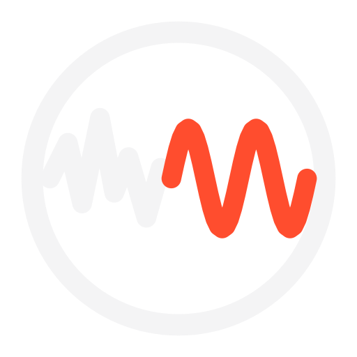

<p align="center">
  
</p>

<h1 align="center">Vibe Code Detector</h1>

<p align="center">
  <strong><a href="https://vibecodedetector.fanficnow.com">vibecodedetector.fanficnow.com</a></strong>
</p>

<p align="center">
  Paste a URL or some source code. Get a percentage, the evidence behind it,
  and an honest account of why you should not trust it too much.
</p>

<p align="center">
  <a href="LICENSE"></a>
  
  
</p>

---

## What it does

Two modes, no account, nothing stored.

- **Live page** — fetches a URL and up to four of its own stylesheets and scripts,
  then reads it the way you would with View Source open: builder fingerprints
  first, then structure, then the look of the thing.
- **Pasted code** — reads a source file in any language for the tells that survive
  in text: comment habits, error handling, naming, dependency incoherence, the
  security profile.

Either way you get a score out of 100, a verdict, a confidence level, and **every
signal that fired with the excerpt that triggered it**. You can then download a
signed one-page PDF certificate, which anyone can check at
[/verify](https://vibecodedetector.fanficnow.com/verify).

## What it does not do

It does not prove anything, and the interface says so before it says anything else.

Peer-reviewed benchmarks put off-the-shelf detection of AI-generated *source* at
around chance. Pan et al., *Assessing AI Detectors in Identifying AI-Generated Code*
(ICSE-SEET 2024), measured five detectors at roughly 0.5 accuracy across 5,069
human-written Python solutions.
Linters and formatters normalise away the statistical signal these tools depend on,
masking is cheap, and every stylistic tell weakens as models improve and as human
developers adopt the same frameworks.

So this tool is built to be *read*, not quoted. The number is the least
interesting thing on the results page.

**Do not use it to accuse anyone of anything.** False-positive harm in academic and
hiring contexts is real and falls hardest on people who did nothing wrong.

## How it scores

Every signal carries a weight in log-odds. Scoring starts from a prior of −1.0 — the
assumption that a given subject is *not* generated — sums the weights of what was
found, and pushes the total through a logistic curve.

Evidence is ranked, because evidence is not equal:

| Tier | Example | Weight |
|---|---|---|
| Platform fingerprint | `cdn.gpteng.co`, a `lovable-tagger` marker, a builder's generator meta tag | 4.5 — decisive |
| Structural | uniform comment density, the same problem solved several ways, code wired to nothing | 0.6–1.1 |
| Code style | what-not-why comments, swallowed exceptions, tests that assert nothing | 0.4–1.3 |
| Content & security | generic testimonials, placeholder secrets, textbook-insecure defaults | 0.4–0.9 |
| Aesthetic | indigo gradients, Inter, three identical cards | 0.25–0.45, **capped as a group** |
| Human authorship | ticket references, exasperated comments, commented-out code, mixed indentation | subtracts |

Five rules the scoring will not break:

1. Aesthetic evidence is capped. A subject with nothing but aesthetic tells cannot
   exceed **55%**, however purple it is.
2. No reading reaches 0% or 100%. The scale is clamped to 3–97.
3. Thin input is pulled toward the middle and reports insufficient confidence,
   rather than being quietly guessed at.
4. Confidence never exceeds *moderate* without a platform fingerprint — pattern
   reading without repository history has not earned more than that.
5. Human signals are first-class and weighted on the same scale as the rest.

All 55 signals, with their weights and reasoning, are in
**[docs/SIGNALS.md](docs/SIGNALS.md)** — generated from `lib/Catalog.php`, so the
documentation cannot drift from the code.

### The strongest signal is one this tool cannot see

Repository history. One enormous initial commit followed by a trail of "fix typo"
commits is far harder to fake retroactively than anything in a served page or a
pasted file. If you have the repo, read `git log` first and treat this tool as a
footnote. Where trust is not adversarial, ask the developer.

## This app was vibecoded

All of it. The detection engine, the website, the PDF writer, the logo, the test
suite — generated by an AI agent in a single sitting, from a research brief.

**A vibecoded app for detecting vibecoded apps.** That is not an admission buried in
a contributing guide; it is on the [front page of the
site](https://vibecodedetector.fanficnow.com/#provenance), because it is the most
useful thing this project has to say about its own reliability.

Point the detector at this site and it returns **55% — Inconclusive**. That is a
false negative on a codebase that is entirely generated, and both reasons are
documented above rather than discovered here:

- **Nothing to fingerprint.** Agentic editors write into an ordinary repository. No
  badge, no builder subdomain, no injected runtime. Signs run in one direction only,
  and this repo is the direction they do not run in.
- **The tells were avoided on purpose.** No what-comments, no docblock on every
  trivial function, no indigo gradient, no Inter, no three-card grid. That is
  masking, and masking is cheap. It took no particular effort.

The score sits at 55 because the aesthetic cap holds it there: some stylistic
signals fire, no structural ones do, and the scoring refuses to reach a verdict on
stylistic evidence alone. It is behaving exactly as designed, and it is still wrong
about the thing it is running on.

None of this is special-cased away, and a detector that exempted itself would be
worth less than one that takes the hit. If it makes you trust the number less: good.
That is what showing the evidence is for.

## Running it locally

```bash
git clone https://github.com/goldo9824/vibecode-detector.git
cd vibecode-detector
php -S localhost:8000
```

Then open <http://localhost:8000>. There is nothing to install first.

```bash
php tests/run.php                       # the whole suite, ~140 assertions
php tools/gen-signals-doc.php           # regenerate docs/SIGNALS.md
php tools/build-assets.php              # regenerate the SVG files from lib/Brand.php
```

## Deploying

Built for LWS shared hosting: upload the folder over FTP and it runs. No Composer,
no npm, no build step, no database, no cron.

The PDF certificates are generated by a hand-written PDF 1.4 writer
(`lib/Pdf.php`) using the standard-14 fonts, precisely so that there is nothing to
install on the host.

Full instructions, including the two 403 checks to run afterwards, are in
**[docs/DEPLOY-LWS.md](docs/DEPLOY-LWS.md)**.

## Layout

```
index.php          the page
verify.php         certificate verification
api/               analyze.php, certificate.php
lib/
  Catalog.php      every signal, its weight and its reasoning — the source of truth
  Report.php       scoring, verdict bands, guard rails
  SiteAnalyzer.php live-page analysis
  CodeAnalyzer.php source analysis
  Fetcher.php      HTTP with SSRF protection
  Pdf.php          a small PDF 1.4 writer
  Brand.php        the mark, as geometry
  Certificate.php  certificate layout
assets/            css, js, svg
tests/             fixtures and the runner
tools/             doc and asset generators
```

## Privacy

No account, no tracking, no analytics, no database, no logs. Pasted code is read
once in memory and discarded; it is never written to disk. Certificates are signed
rather than stored, which is why verification is a signature check and not a
lookup — there is nothing to look up.

## Contributing

New signals are welcome, especially ones that are hard to mask. A signal has to
justify its weight and come with a fixture; see
**[CONTRIBUTING.md](CONTRIBUTING.md)**.

If the tool got something wrong, that is the most useful bug there is:

- [Report a wrong reading](https://github.com/goldo9824/vibecode-detector/issues/new?template=false_positive.yml)
- [Propose a signal](https://github.com/goldo9824/vibecode-detector/issues/new?template=signal_proposal.yml)
- [Report a bug](https://github.com/goldo9824/vibecode-detector/issues/new?template=bug_report.yml)

## Credits

The detection reference this is built on is summarised in
[docs/REFERENCE.md](docs/REFERENCE.md), with sources.

The indigo problem has a named origin: on 7 August 2025 Tailwind co-creator Adam
Wathan apologised for making every button in Tailwind UI `bg-indigo-500` five years
earlier, "leading to every AI generated UI on earth also being indigo".

## Licence

MIT. See [LICENSE](LICENSE).
